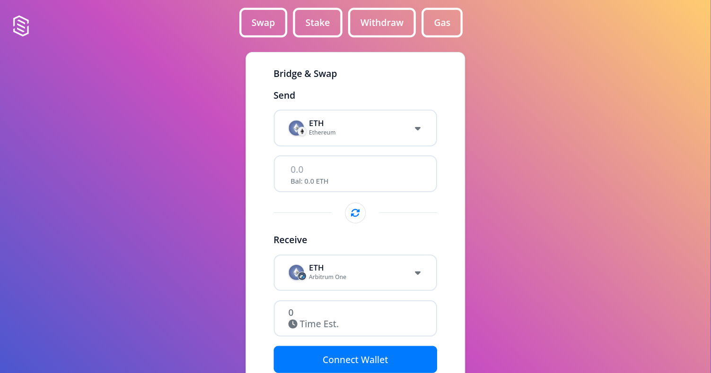

# indEX

This project demonstrates how you can create a cryptocurrency exchange platform. It is designed to connect to all supported chains, bridges, and exchanges, offering a comprehensive and versatile platform for cryptocurrency transactions.

## Features

- **Comprehensive Connectivity:** Connect to a wide range of chains, bridges, and exchanges, ensuring broad compatibility and access.
- **Smart Routing:** Utilize advanced routing techniques, with the option to customize access to specific chains, tokens, and bridges.
- **Wallet Management:** Supports extensive wallet options, facilitating seamless asset transfers between different blockchain networks.
- **Transaction Tracking:** Keep track of transactions in real-time and access detailed records of ongoing and past transactions.
- **Flexible Integration:** Designed for easy integration into React applications or for embedding as a Web Component, providing versatile deployment options.
- **Interactive Experience:** Offers an intuitive and user-friendly interface, allowing users to experience the platform's capabilities firsthand.

## Set up

To get started, follow these general steps:

- Sign up for a free account on the platform's website.
- Set up your project and copy your unique project identifier.
- Update the project ID in the 'app.component.ts' file to use the platform's features.

### Run Locally

To run your project locally, follow these steps:

```bash
npm install
```
